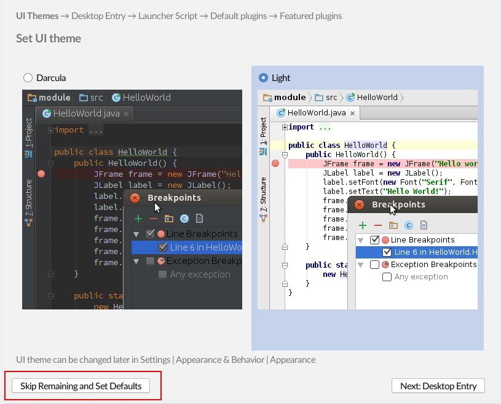
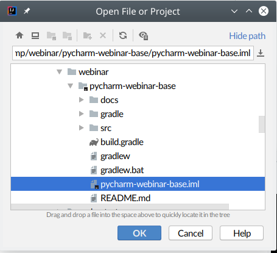
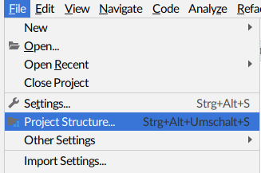
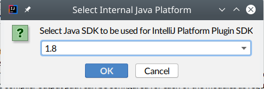
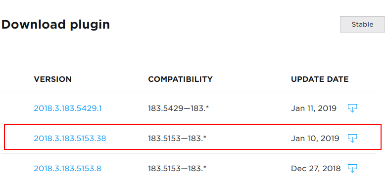
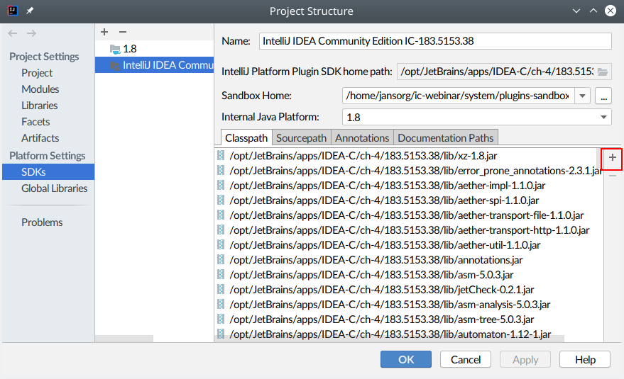
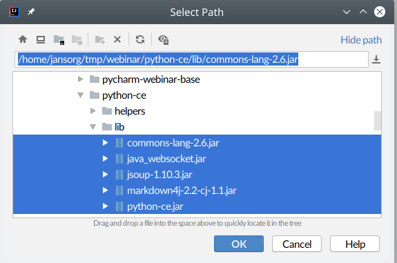
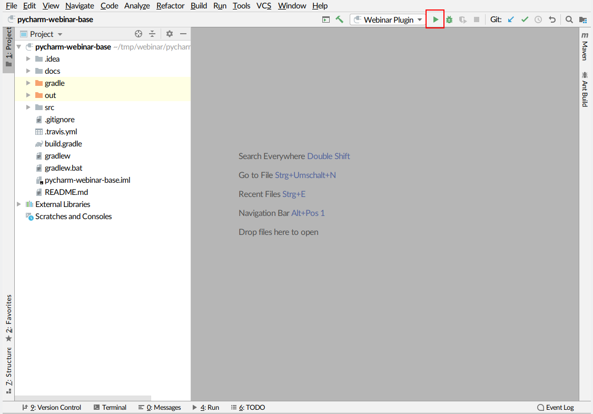

[](https://travis-ci.org/jansorg/pycharm-webinar-base)

# PyCharm Webinar 2019
Welcome to the PyCharm webinar!

This is the base setup used in Webinar. For details about the webinar see [the PyCharm blog](https://blog.jetbrains.com/pycharm/2018/12/webinar-live-development-of-a-pycharm-plugin-with-joachim-ansorg/).

## Please report an issue if the setup isn't working for you!
These steps won't be shown in the webinar. They're necessary only once to setup your environment to work on a Python plugin.

## Setup your IDE
1. **Clone** this repository:
   ```bash
   git clone https://github.com/jansorg/pycharm-webinar-base.git
   ```
1. **Install IntelliJ 2018.3.3** (Community or Ultimate). 

   Download it from [JetBrains](https://www.jetbrains.com/idea/). Feel free to use the Toolbox app, if you prefer that.
    
   In the following steps we assume that you downloaded 2018.3.3. 
   If you didn't, then make sure that you choose the right versions of the Python plugins.
1. **Start the IntelliJ IDE**. Make sure that the DevKit plugin is enabled, we'll need it!
   - If it's the first statup, then it'll look like this. Choosing 'Skip Remaining and Set Defaults' is fine.
    
    
   - Choose 'Open' if it's the first startup or "File > Open" if you're already using IntelliJ.
1. Make sure to choose the repository directory `pycharm-webinar-base` in the file selector. If you don't then the project won't work for plugin development.
 
    
1. **Setup your IntelliJ SDK**
    - Choose `File > Project settings...`
 
       
    - If you do not yet configured a Java SDK, then do this first. This has to be a Java 1.8 SDK!
    - Now setup your IntelliJ SDK. Click `New...` on the project page and select `IntelliJ Platform Plugin SDK`. The default location should be the installation path of your IntelliJ 2018.3.3. Use this path for your new SDK setting.  
       
       
    - Make sure to choose your Java 1.8 SDK in the next screen:
      
       
1. Now **download the Python plugin** to wrap up the setup of your project's SDK. 

   The PyCharm package can't be used as an SDK because it's not coming with the plugin development tooling we need.
   
   Download the PyCharm plugin which matches your edition of IntelliJ. Choose the download which is compatible with 2018.3.3. 
   - Plugin for IntelliJ Community: https://plugins.jetbrains.com/plugin/7322-python-community-edition\
   
     
   - Plugin for IntelliJ Ultimate: https://plugins.jetbrains.com/plugin/631-python
   
      
1. The downloaded file is a ZIP file. **Unzip** it on disk. We'll need it in the next step.
1. **Add the PyCharm plugin to the SDK** to let IntelliJ know about the Python plugin: 
   1. Choose `File > Project Settings ...` and select the page `SDK`:
  
      
   1. Navigate to the directory of the unzipped Python plugin. Select everything belwo `python-ce/libs/` and click `Ok`:
   
      
   1. Close the dialog with `Ok`.
     
1. Almost ready! 
1. **Run the plugin to test your environment**: Click on the little arrow next to the run configuration `Webinar Plugin`:

   
1. Now the plugin will be compiled, packaged and started within a new instance of IntelliJ. If you see error messages, the
   there's something wrong with your setup.

## General notes

### Directory structure
- `src/main/java`: Java sources
- `src/main/resources`: Java resource files
- `src/test/java`: Java test case sources
- `src/test/resources`: Java test case resource files

### Continuous integration builds
`.travis.yml` configures a [travis-ci.com](https://travis-ci.com/) build.

### Relevant Documentation 
- Introduction to plugin development: https://www.plugin-dev.com/intellij/introduction/
- IntelliJ DevGuide: http://www.jetbrains.org/intellij/sdk/docs/welcome.html
- Gradle build plugin: http://www.jetbrains.org/intellij/sdk/docs/tutorials/build_system.html
